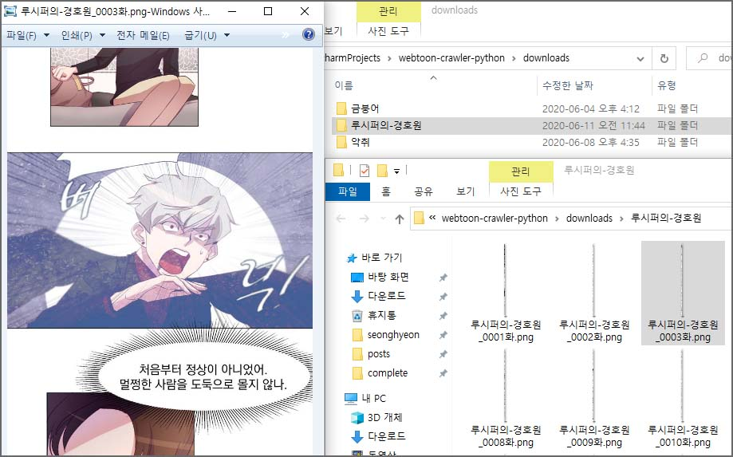

# K-webtoon-crawler
[](https://hits.seeyoufarm.com)

무료로 볼 수 있는 웹툰을 로컬에 다운로드할 수 있는 프로그램입니다. 현재 버전은 네이버 웹툰의 완결웹툰 중
스토어에 가지 않은 무료 웹툰을 자동으로 전부 다운로드합니다.


* 지원하는 사이트
    * [네이버 웹툰](https://comic.naver.com/index.nhn)
* 지원 예정
    * [다음 웹툰](http://webtoon.daum.net/)
    * [Webtoons.com](https://www.webtoons.com/en/)




## 설치 / 실행 방법
1. Python 3.x 설치
   * Windows: [링크](https://www.python.org/)
   * Linux: ```$ apt install python3.8```
1. 복사 (git clone 또는 zip 다운로드 후 압축해제)
   ```sh
   $ git clone https://github.com/sh-cho/k-webtoon-crawler.git
   ```
1. 모듈 설치
   ```sh
   # Linux
   $ source venv/bin/activate
   (venv) $ pip install -r requirements.txt
   
   # venv 나올때는 deactivate 입력
   ```
   ```PowerShell
   # Windows (PowerShell)
   PS C:\Users\...> .\venv\Scripts\Activate.ps1
   (venv) PS C:\Users\...> pip install -r requirements.txt
   ```
   ```sh
   # venv 없이 그냥 설치 (비추)
   $ pip install -r requirements.txt
   ```
1. 환경 설정: ```account.json.tmpl```를 복사해 ```accounts.json``` 생성 후 사이트 별 아이디, 비밀번호 입력
   ```JSON
   {
     "naver": {
       "id": "입력입력",
       "pw": "입력입력"
     }
   }
   ```
1. 실행
   ```sh
   $ python main.py
   ```
* Windows에서 python PATH 등록이 되지 않은 경우 (python 3.8 기준)
   ```PowerShell
   PS %userprofile%\Appdata\Local\Programs\Python\Python38\python.exe main.py
   또는
   PS C:\Users\{유저명}\Appdata\Local\Programs\Python\Python38\python.exe main.py
   ```


## 프로젝트 구조
    .
    └── main
        └── WebtoonCrawler
            ├── WebtoonScraper
            │   ├── NaverWebtoonScraper
            │   ├── (TODO) DaumWebtoonScraper
            │   └── (TODO) WebtoonsDotcomScraper
            └── ScraperUtil


## Dependencies
requirements.txt를 참고해주세요.
* requests
* beautifulsoup4
* lxml
* Pillow
* lzstring
* rsa


## 개발 환경
* OS: Windows 10
* IDE: PyCharm 2019.3.3 (Community Edition)
* Python 3.8.2


## 정보
<https://github.com/sh-cho/k-webtoon-crawler>


## Disclaimer
다운로드받은 파일은 개인 소장용으로만 이용해야 하며, 재배포 또는 판매할 수 없습니다.

> 저작권법 [시행 2020. 5. 27] [법률 제16600호, 2019. 11. 26., 일부개정]
> 
> 제30조(사적이용을 위한 복제) 공표된 저작물을 영리를 목적으로 하지 아니하고 개인적으로 이용하거나
> 가정 및 이에 준하는 한정된 범위 안에서 이용하는 경우에는 그 이용자는 이를 복제할 수 있다. 다만,
> 공중의 사용에 제공하기 위하여 설치된 복사기기, 스캐너, 사진기 등 문화체육관광부령으로 정하는
> 복제기기에 의한 복제는 그러하지 아니하다. <개정 2020. 2. 4>


## Note
* Issues and Pull Requests are always welcome.
* [gallery-dl](https://github.com/mikf/gallery-dl) 프로젝트에 머지하기 위해 준비중입니다.